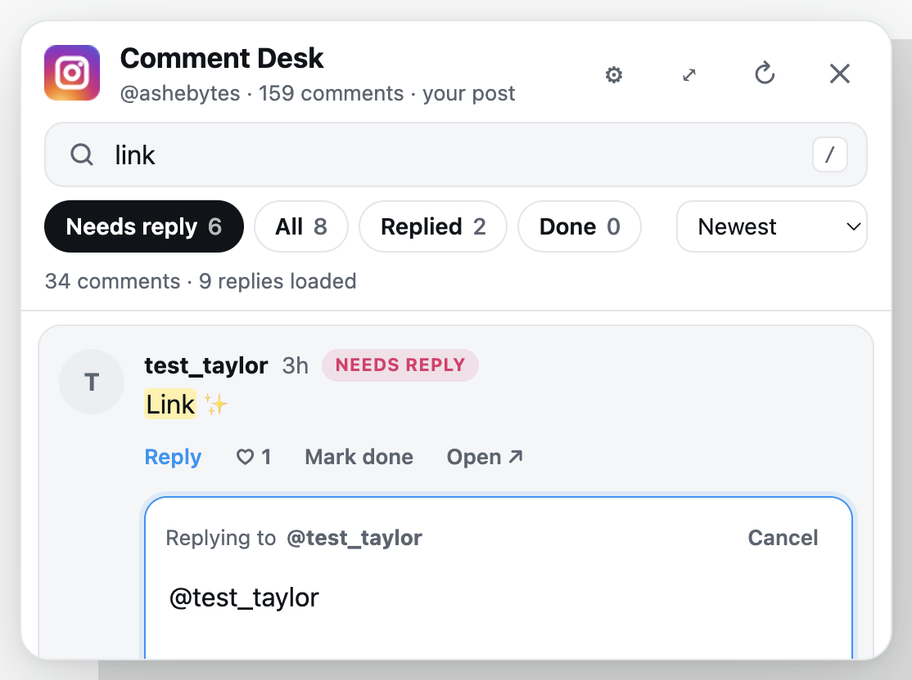

# Instagram Comment Desk

A Chrome extension that turns the tiny Instagram comment column into a big, searchable reply inbox — on your own posts and reels.



## Install

1. Open `chrome://extensions`
2. Turn on **Developer mode** (top right)
3. Click **Load unpacked** and pick this folder
4. Pin the extension, then open one of your posts on instagram.com

Nothing showing up? Click the extension's toolbar icon, or refresh the Instagram tab. After editing the code, hit ↻ on the extension card in `chrome://extensions`. Open Instagram tabs are picked up automatically.

## What it does

- **Opens automatically on your own posts/reels** as a large side panel (toggle wide mode with ⤢). On anyone else's post, click the floating Instagram button or the toolbar icon.
- **Loads every comment and reply**, not just the handful Instagram shows.
- **Search** across comment text, usernames, and replies, with highlighted matches.
- **Needs reply / Replied / Done** filters. It checks each thread for a reply from you, so "Needs reply" is an actual to-do list. Mark a comment "Done" to clear it without replying.
- **Inline replies** with the `@mention` pre-filled, emoji and quick-reply buttons (edit them in ⚙︎), and Enter to send. In "Needs reply" it jumps straight to the next comment after you send.
- Like/unlike comments, sort by newest/oldest/most liked/most replies, and open any comment on Instagram.

## Keyboard

| Key | Action |
| --- | --- |
| `/` | Search |
| `j` / `k` | Move between comments |
| `r` or `Enter` | Reply to selected |
| `l` | Like selected |
| `d` | Mark selected done |
| `Esc` | Cancel reply / close panel |
| `Option+Shift+C` | Toggle the panel from anywhere on Instagram |

## How it works

The content script calls the same `instagram.com/api/v1/...` endpoints Instagram's web app uses, with your existing logged-in session. Nothing leaves your browser. "Done" marks, replied markers, and settings are stored in `chrome.storage.local`.

Loading is paced (a few requests per second) to stay clear of Instagram's rate limits. On posts with thousands of comments, the first load takes a minute or two.

## Development

`dev/harness.html` fakes the Instagram API so the panel can be tested without logging in:

```sh
node dev/serve.js
# open http://localhost:5178/p/Ddo7FMeSVJh/
```

Icons are generated with `python3 scripts/make-icons.py` (requires Pillow).

## Disclaimer

Not affiliated with, endorsed by, or sponsored by Instagram or Meta. Instagram and its logo are trademarks of Meta Platforms, Inc. This extension uses Instagram's undocumented web endpoints, which can change without notice. Use it at your own risk and within Instagram's terms.

## License

[MIT](LICENSE) · [Privacy](PRIVACY.md)
